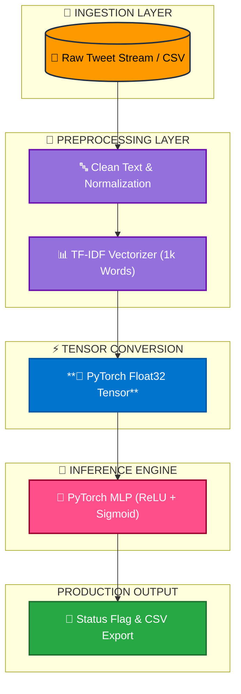

# DEEP LEARNING PROJECT 1
# Real-Time Disaster Tweet Classification Pipeline (PyTorch). 

📌 **Project Overview**  
This project demonstrates an enterprise-grade, end-to-end Natural Language Processing (NLP) pipeline built using **PyTorch** and **Scikit-Learn** to classify social media text into real-time emergency disaster alerts versus routine social chatter.

The repository is architected with complete decoupling between **Model Training** and **Batch Inference**, adhering to modern MLOps principles to prevent data leakage and facilitate seamless production batch scoring.

---

### 🚨 The Problem
Deploying machine learning models in critical real-time environments often faces standard failure modes:
* **Data Leakage:** Inconsistent preprocessing or re-fitting transformers on evaluation data distorts real-world model reliability.
* **Monolithic Notebooks:** Training code mixed with inference logic makes automated server execution brittle and difficult to maintain.
* **Manual Data Filtering:** Emergency response teams cannot manually parse millions of social media streams to identify time-critical alerts.

---

### 💡 The Solution
An automated, production-ready NLP classification framework that:
* Implements a decoupled architecture separating **Model Training** (`01_model_training.py`) from **Batch Inference** (`02_batch_inference.py`).
* Vectorizes unstructured text via a pre-fitted **TF-IDF Vocabulary Transformer** to prevent out-of-sample data contamination.
* Deploys a **PyTorch Neural Network** optimized for rapid binary classification (0.0 to 1.0 probability scoring).
* Persists model artifacts to disk for instant, automated batch scoring and alert flag generation.

---

### ⚙️ Tech Stack & Architecture
* **Engine:** PyTorch (`torch.nn`, `torch.optim`) & Scikit-Learn
* **Feature Extraction:** Term Frequency-Inverse Document Frequency (`TfidfVectorizer`)
* **Environment:** Python / Jupyter Notebooks
* **Data Pipelines:** Pandas & NumPy for batch vector array manipulation
* **Serialization:** PyTorch State Dict (`.pth`) & Joblib (`.pkl`)

---

### 🔄 Pipeline Architecture
1. **Ingestion & Preprocessing:** Ingests raw tweet text, normalizes casing, and strips non-alphanumeric noise.
2. **TF-IDF Vectorization:** Transforms cleaned text into a sparse matrix representing the top 1,000 keyword features.
3. **Tensor Conversion:** Converts numerical matrices into PyTorch `float32` Tensors.
4. **PyTorch Neural Network:** Passes features through a multi-layer feedforward architecture with ReLU activation and Sigmoid output.
5. **Loss & Optimization:** Trains via Binary Cross-Entropy Loss (`BCELoss`) optimized by the Adam algorithm ($\text{lr} = 0.005$).
6. **Batch Inference Engine:** Loads saved artifacts, evaluates unseen batch CSV inputs, and exports categorized risk flags.

---

### 🔄 Pipeline Graphical Architecture

## 🧠 Key Technical Achievements & Metrics

The neural network was evaluated on unseen holdout test data (1,523 records) to verify out-of-sample generalization:

* **Test Accuracy Score:** **78.33%** correct classification on unseen evaluation data.
* **Optimization Convergence:** Loss steadily decreased from **0.5889** (Epoch 20) down to **0.3360** (Epoch 100).
* **Batch Processing Output:** High-confidence distinction between real emergencies (e.g., *Typhoon Soudelor* @ **97.45%**) and casual social banter (e.g., *Sports chatter* @ **2.80%**).

---

## ✅ Production Output Sample

When executing batch inference on unseen CSV inputs (`02_batch_inference.py`), the engine generates automated probability scores and status flags:

| Tweet Text | Probability Score | Status Flag |
| :--- | :---: | :---: |
| "Just happened a terrible car crash" | 0.8857 | 🚨 CRITICAL DISASTER |
| "Typhoon Soudelor kills 28 in China and Taiwan" | 0.9745 | 🚨 CRITICAL DISASTER |
| "Hey! How are you?" | 0.0873 | ✅ NORMAL CHATTER |
| "What a nice hat?" | 0.0775 | ✅ NORMAL CHATTER |

---

## 🚀 Future Improvements

* **Containerization:** Containerize the batch inference pipeline into a Docker image for serverless deployment on AWS Lambda.
* **Dashboard Integration:** Connect the output prediction pipeline directly to a Power BI / Grafana Dashboard for real-time alert visualization.
* **Transformer Architecture:** Upgrade the core embedding engine from TF-IDF to transformer-based models (BERT / RoBERTa) using Hugging Face.

---

## 👨‍💻 Author

**Data Engineer / Analyst** — Building scalable machine learning pipelines, production data architectures, and real-time inference systems.
